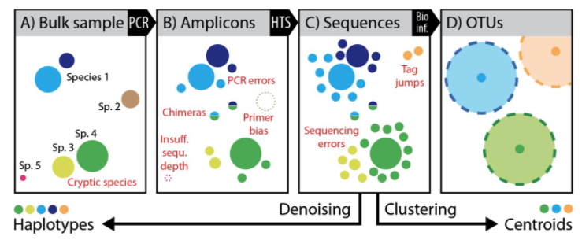

---
output:
    github_document:
    pandoc_args: --webtex
always_allow_html: true
---
<!-- README.md is generated from README.Rmd. Please edit that file -->

```{r, include = FALSE}
knitr::opts_chunk$set(
  collapse = TRUE,
  comment = "#>",
  fig.path = "imgs/",
  out.width = "100%"
)

knitr::opts_chunk$set(echo = TRUE)
```


<!-- badges: start -->


<!-- badges: end -->

# Metataxonômica usando o sequenciamento masivo do gene 16S rRNA
**Autor: Kelly Hidalgo**

Em este tutorial você aprenderá como processar sequencias do gene 16S rRNA com duas abordagens: **1)** DADA2 usando a linguagem de programação R no IDLE RStudio e **2)** Qiime2. 

## Introdução

Ambos pipelines são capazes de analizar sequencias do gene 16S rRNA usando ASVs (*Amplicon Sequence Vatiants*) ao invés de OTUs (*Operational Taxonomic Units*).

A continuação, vamos a comparar ambas abordagens:

**Qiime2**

* *User-friendly*
* Interfaz gráfica
* Muita documentação [qiime2.org](https://docs.qiime2.org/2021.4/)
* Geração rápida de gráficos
* Requiere pouco conhecimento em bioinformática e/ou linguagens de programação

**DADA2**

* Mais **acurado**
* Melhor *performance*
* Requiere conhecimento na linguaguem de programação R

### OTU vs ASV

Agora, vamos a revisar muito superficialmente que é OTU e ASV.

**OTU *(Operational Taxonomic Unit)*:** É a mímina unidade taxonômica usada para classificar grupos de individuos relacionados. Tipicamente, com esta definição, las sequencias são agrupadas baseado na porcentagem de similaridade entre ellas (usualmente 97% de similaridade). Se ainda não conseguiu entender, tente pensar que cada OTU é como uma caixa, que pode ter nome (espécies conhecidas) ou não (espécies desconhecidas) e dentro de cada caixa todos os individuos são similares entre eles em no mínimo um 97%.
**ASV (*Amplicon Sequence Vatiant*):** É o termo usado para se referir a sequencias de DNA individuais. Agora já não é mais possível pensar que são caixas, porque os ASVs não são agrupados por similaridade. Este conceito considera que cada sequencia é diferente de outra desde a variação de uma base nucleotídica. 
 
**Mas por que existem dois conceitos diferentes?** Bom, porque os investigadores tem observado que duas espécies nem sempre são diferentes porque as sequencias sejam 3% dissimilares. Há casos onde sequencias com menos de 3% de dissimilaridad são a mesma espécie. E outro casos onde espécies com 97% de similaridade na realidade não são a mesma espécie. 

A seguinte figura mostra a diferença entre os dois tipos de clusterização.
 

Esta figura é modificada da figura S1 de [*Callahan et al. 2016*](https://www.nature.com/articles/nmeth.3869)


A figura mostra um visão global do processo de metabarcoding, com os potenciais viéses que podem afetar a acúracia do sequenciamento. Na seção **(A)** na amostra há várias espécies com diferente quantidade de biomasa (indicado pelo tamanho das bolinhas) e distintos haplótipos (indicado pela cor). Depois da extração de DNA, o *barcode* é amplificado usando PCR **(B)**, o qual vai distorcer as abundâncias das sequências, e também pode não amplificar taxas devido ao viés nos primers ou profundidade insuficiente do sequenciamento no caso de espécies subrepresentadas/raras (*rosa - sp.5*). No processo de sequenciamento *high-throughput* **(C)**, muitas novas sequências de falsos positivos são geradas devido aos erros de sequenciamento, formação de quimeras e mistura de amostras multiplexadas. O impacto de estes erros frequentemente pode ser reduzido em um processo de filtragem riguroso e agrupando sequências similares em OTUs. Normalmente, só a sequência mais abundante em uma OTU é considerada e usada para identificar a respectiva espécie (centroide), o que por sua vez significa que as informações sobre diversidade são perdidas. **(D)** as estrategias de ***denoising*** são usadas para remover do dataset sequências com afetadas por erros are used to remove error-affected sequences from a dataset e reativar as sequências de haplótipos reais presentas em uma amostras. O Denoising (remoção do ruído) pode discriminar entre um erro do sequenciamento ou da amplificação com PCR e uma espécie diferente (diferença de pelo menos um nucleotídeo). A base é que se a sequência estiver super-representada (abundante), é mais provável que seja uma determinada sequência, mas se a sequência estiver em baixa abundância é provável que seja devido a um erro na PCR ou no sequenciamento. Em resumo, usando o conceito de OTU, neste exemplo conderaríamos apenas 3 OTUs ou espécies diferentes, enquanto que usando a abordagem de denoising é possível obter 5 ASVs ou espécies diferentes.

---

# I Metataxonomica com Qiime2

## 0. Instalações

### 0.1. Intalação Anaconda

É recomendável instalar Anaconda, pois é a forma mais fácil para instalar as ferramentas bioinformáticas necessárias pro desenvolvimento deste pipeline. Anaconda é uma distribuição livre e aberta das linguagens *Python* e *R*, utilizada na ciência de dados e bioinformática. As diferente versões dos programas se administram mediante um sinstema de gestão chamado *conda*, o qual faz bastante simples instalar, rodar e atualizar programas. [Aqui](https://conda.io/projects/conda/en/latest/user-guide/install/index.html) se encontram as instruções para a instalação de Anaconda. 

Depois de instalado, *Anaconda* e o gestor *Conda*, podram ser criados *ambientes virtuais* par a instalação das diferentes ferramentas bioinformática que serão usadas. 

### 0.2. Instalação Qiime2-2021.4

Uma vez instalado Anaconda, use as seguintes [instruções](https://docs.qiime2.org/2021.4/install/native/#install-qiime-2-within-a-conda-environment) para instalar facilmente **Qiime2-2021.4**. 

### 0.3. Instalação RESCRIPt

RESCRIPt (*REference Sequence annotation and CuRatIon Pipeline*) é uma ferramenta escrita em python3 para gestionar e curar as bases de dados, sequencias de DNA/RNA e a informação taxonômica. [Repositório GitHub](https://github.com/bokulich-lab/RESCRIPt).

Para instalar este plugin dentro do Qiime2, siga as seguintes instruções:

```
## Ative o ambiente qiime2-2021.4
conda activate qiime2-2021.4
## Instale as dependencias
conda install -c conda-forge -c bioconda -c qiime2 -c defaults xmltodict
## InstaLe desde a fonte
pip install git+https://github.com/bokulich-lab/RESCRIPt.git
```

## 1. Organizando os dados

### 1.1. Amostras

Para este tutorial será usado um *dataset* de sequenciamento do gene 16S rRNA com Illumina (*paired-end*) de 28 amostras de lodos de duas plantas de tratamento de esgoto, uma numa escola pública localizada no municipio de Pinhal e outra de uma fábrica de fibra de vidro da cidade de Iracemápolis. Pra mais detalhes, consulte o [paper](https://link.springer.com/article/10.1007/s10532-020-09921-y) publicado sobre o estudo.

Para descarregar os dados:

```
## Crie um diretório base
mkdir metataxonomics

cd metataxonomics/
## Crie um diretório para os dados
mkdir 00.RawData

cd 00.RawData/

## Descarregue o arquivo .zip
wget https://figshare.com/ndownloader/files/31594295

## Faça unzip no arquivo
unzip 31594295

## Clean the directory
rm 31594295
```

Agora, com `ls` liste os arquivos dentro de `00.RawData`, se deve ver assim:

```
sample1_1.fq.gz   sample1_2.fq.gz   sample2_1.fq.gz   sample2_2.fq.gz   sample3_1.fq.gz   sample3_2.fq.gz   sample4_1.fq.gz   sample4_2.fq.gz   sample5_1.fq.gz   sample5_2.fq.gz   sample6_1.fq.gz   sample6_2.fq.gz   sample7_1.fq.gz   sample7_2.fq.gz   sample8_1.fq.gz   sample8_2.fq.gz   sample9_1.fq.gz   sample9_2.fq.gz   sample10_1.fq.gz   sample10_2.fq.gz   sample11_1.fq.gz   sample11_2.fq.gz   sample12_1.fq.gz   sample12_2.fq.gz   sample13_1.fq.gz   sample13_2.fq.gz   sample14_1.fq.gz   sample14_2.fq.gz   sample15_1.fq.gz   sample15_2.fq.gz   sample16_1.fq.gz   sample16_2.fq.gz   sample17_1.fq.gz   sample17_2.fq.gz   sample18_1.fq.gz   sample18_2.fq.gz   sample19_1.fq.gz   sample19_2.fq.gz   sample20_1.fq.gz   sample20_2.fq.gz   sample21_1.fq.gz   sample21_2.fq.gz   sample22_1.fq.gz   sample22_2.fq.gz   sample23_1.fq.gz   sample23_2.fq.gz   sample24_1.fq.gz   sample24_2.fq.gz   sample25_1.fq.gz   sample25_2.fq.gz   sample26_1.fq.gz   sample26_2.fq.gz   sample27_1.fq.gz   sample27_2.fq.gz   sample28_1.fq.gz   sample28_2.fq.gz
```
É muito recomendado rodar todos los comando desde o diretório base `metataxonomics/`
```
cd ..
# Onde estou?
pwd
```

Se estiver correto, você estará dentro da pasta `~/metataxonomics`

## 2. Importar as sequências como artefato `.qza`

Um dos arquivos especiais do Qiime2 são os artefatos, os quais são considerados para representar os dados intermediarios na análise. Assim, os artefatos são considerados arquivos gerado por Qiime2 e só podem ser usados em Qiime2. A extensão é `.qza` que significa *Qiime Zipped Artifact*, para mais informação, Qiiem2 tem um [glossário](https://docs.qiime2.org/2021.4/glossary/).

Neste passo as sequências serão importadas como arquivo `.qza`. Antes disso, é necessário criar um arquivo chamado `ManifestFile.csv`, onde devem ser indicados os caminhos e nomes das amostras, com o intuito de que o Qiime2 seja capaz de importar as *reads*. Há outras maneiras de importar as *reads* que dependen do tipo de sequências a serem importadas. [Aqui](https://docs.qiime2.org/2021.4/tutorials/importing/), encontra informações sobre isto.

Para criar o `ManifestFile.csv`, pode usar excel ou diretamente no bash, seguindo as instruções a continuação:

Abra o editor de texto `nano`
```
nano ManifestFile.csv
```

Faça uma tabela de três colunas separadas com vírgulas `,`. A primeira coluna deve ser `sample-id`, aqui você indica o nome da amostra personalizada, a segunda coluna é `absolute-filepath` para colocar o caminho para cada pair, e a última coluna é `direction`, para indicar se se trata do pair *forward* ou *reverse*.

Tanto na fábrica de fibra de vidro (**I**racemápolis) como na escola (**P**inhal) foram amostrados lodos no tanque septico (ST), e no filtro anaeróbico (AF) nas quatro estações do ano, durante 2018 e 2019. Então por exemplo a amostra 4 (Sample4), com sample-id STI1-Jan19, é uma amostra de lodo tomado no tanque septico (ST) da fábrica de vidro (I) em Janeiro do 2019 (Jan19) e é a replicata 1 (todas as amostras foram tomadas em duplicata).

Se sua maquina tem uma boa capacidade (mínimo processador com 8 núcleos e 16 Gb de RAM) processe todas as amostras usando o seguinte ManifestFile. Se pelo contrário quer testar no seu laptop (mínimo processador com 4 núcleos, 8 Gb de RAM), use o segundo ManifestFile que contém menos amostras. 

Aqui o exemplo (todas as 28 amostras):
```
sample-id,absolute-filepath,direction
STI2-Apr19,$PWD/00.RawData/sample1_1.fq.gz,forward
STI2-Apr19,$PWD/00.RawData/sample1_2.fq.gz,reverse
STI1-Apr19,$PWD/00.RawData/sample2_1.fq.gz,forward
STI1-Apr19,$PWD/00.RawData/sample2_2.fq.gz,reverse
AFI2-Jan19,$PWD/00.RawData/sample3_1.fq.gz,forward
AFI2-Jan19,$PWD/00.RawData/sample3_2.fq.gz,reverse
STI1-Jan19,$PWD/00.RawData/sample4_1.fq.gz,forward
STI1-Jan19,$PWD/00.RawData/sample4_2.fq.gz,reverse
STI2-Oct18,$PWD/00.RawData/sample5_1.fq.gz,forward
STI2-Oct18,$PWD/00.RawData/sample5_2.fq.gz,reverse
STI1-Oct18,$PWD/00.RawData/sample6_1.fq.gz,forward
STI1-Oct18,$PWD/00.RawData/sample6_2.fq.gz,reverse
AFI1-Jan19,$PWD/00.RawData/sample7_1.fq.gz,forward
AFI1-Jan19,$PWD/00.RawData/sample7_2.fq.gz,reverse
STI2-Jan19,$PWD/00.RawData/sample8_1.fq.gz,forward
STI2-Jan19,$PWD/00.RawData/sample8_2.fq.gz,reverse
AFI2-Apr19,$PWD/00.RawData/sample9_1.fq.gz,forward
AFI2-Apr19,$PWD/00.RawData/sample9_2.fq.gz,reverse
AFI1-Apr19,$PWD/00.RawData/sample10_1.fq.gz,forward
AFI1-Apr19,$PWD/00.RawData/sample10_2.fq.gz,reverse
AFI2-Oct18,$PWD/00.RawData/sample11_1.fq.gz,forward
AFI2-Oct18,$PWD/00.RawData/sample11_2.fq.gz,reverse
AFI1-Oct18,$PWD/00.RawData/sample12_1.fq.gz,forward
AFI1-Oct18,$PWD/00.RawData/sample12_2.fq.gz,reverse
AFP2-Aug18,$PWD/00.RawData/sample13_1.fq.gz,forward
AFP2-Aug18,$PWD/00.RawData/sample13_2.fq.gz,reverse
AFP1-Aug18,$PWD/00.RawData/sample14_1.fq.gz,forward
AFP1-Aug18,$PWD/00.RawData/sample14_2.fq.gz,reverse
STP1-Aug18,$PWD/00.RawData/sample15_1.fq.gz,forward
STP1-Aug18,$PWD/00.RawData/sample15_2.fq.gz,reverse
STP2-Aug18,$PWD/00.RawData/sample16_1.fq.gz,forward
STP2-Aug18,$PWD/00.RawData/sample16_2.fq.gz,reverse
STI1-Sep18,$PWD/00.RawData/sample17_1.fq.gz,forward
STI1-Sep18,$PWD/00.RawData/sample17_2.fq.gz,reverse
STI2-Sep18,$PWD/00.RawData/sample18_1.fq.gz,forward
STI2-Sep18,$PWD/00.RawData/sample18_2.fq.gz,reverse
STP1-Jun18,$PWD/00.RawData/sample19_1.fq.gz,forward
STP1-Jun18,$PWD/00.RawData/sample19_2.fq.gz,reverse
STP2-Jun18,$PWD/00.RawData/sample20_1.fq.gz,forward
STP2-Jun18,$PWD/00.RawData/sample20_2.fq.gz,reverse
STP1-Jun19,$PWD/00.RawData/sample21_1.fq.gz,forward
STP1-Jun19,$PWD/00.RawData/sample21_2.fq.gz,reverse
STP2-Jun19,$PWD/00.RawData/sample22_1.fq.gz,forward
STP2-Jun19,$PWD/00.RawData/sample22_2.fq.gz,reverse
AFI1-Sep18,$PWD/00.RawData/sample23_1.fq.gz,forward
AFI1-Sep18,$PWD/00.RawData/sample23_2.fq.gz,reverse
AFI2-Sep18,$PWD/00.RawData/sample24_1.fq.gz,forward
AFI2-Sep18,$PWD/00.RawData/sample24_2.fq.gz,reverse
AFP1-Jun18,$PWD/00.RawData/sample25_1.fq.gz,forward
AFP1-Jun18,$PWD/00.RawData/sample25_2.fq.gz,reverse
AFP2-Jun18,$PWD/00.RawData/sample26_1.fq.gz,forward
AFP2-Jun18,$PWD/00.RawData/sample26_2.fq.gz,reverse
STP2-Oct18,$PWD/00.RawData/sample27_1.fq.gz,forward
STP2-Oct18,$PWD/00.RawData/sample27_2.fq.gz,reverse
STP1-Oct18,$PWD/00.RawData/sample28_1.fq.gz,forward
STP1-Oct18,$PWD/00.RawData/sample28_2.fq.gz,reverse
```

Com ctrl+x você pode sair do nano, o sistema vai perguntar se quer salvar as mudanças, dígite `yes`.

Aqui o exemplo (16 Amostras da fábrica de fibra de vidrio):
```
sample-id,absolute-filepath,direction
STI2-Apr19,$PWD/00.RawData/sample1_1.fq.gz,forward
STI2-Apr19,$PWD/00.RawData/sample1_2.fq.gz,reverse
STI1-Apr19,$PWD/00.RawData/sample2_1.fq.gz,forward
STI1-Apr19,$PWD/00.RawData/sample2_2.fq.gz,reverse
AFI2-Jan19,$PWD/00.RawData/sample3_1.fq.gz,forward
AFI2-Jan19,$PWD/00.RawData/sample3_2.fq.gz,reverse
STI1-Jan19,$PWD/00.RawData/sample4_1.fq.gz,forward
STI1-Jan19,$PWD/00.RawData/sample4_2.fq.gz,reverse
STI2-Oct18,$PWD/00.RawData/sample5_1.fq.gz,forward
STI2-Oct18,$PWD/00.RawData/sample5_2.fq.gz,reverse
STI1-Oct18,$PWD/00.RawData/sample6_1.fq.gz,forward
STI1-Oct18,$PWD/00.RawData/sample6_2.fq.gz,reverse
AFI1-Jan19,$PWD/00.RawData/sample7_1.fq.gz,forward
AFI1-Jan19,$PWD/00.RawData/sample7_2.fq.gz,reverse
STI2-Jan19,$PWD/00.RawData/sample8_1.fq.gz,forward
STI2-Jan19,$PWD/00.RawData/sample8_2.fq.gz,reverse
AFI2-Apr19,$PWD/00.RawData/sample9_1.fq.gz,forward
AFI2-Apr19,$PWD/00.RawData/sample9_2.fq.gz,reverse
AFI1-Apr19,$PWD/00.RawData/sample10_1.fq.gz,forward
AFI1-Apr19,$PWD/00.RawData/sample10_2.fq.gz,reverse
AFI2-Oct18,$PWD/00.RawData/sample11_1.fq.gz,forward
AFI2-Oct18,$PWD/00.RawData/sample11_2.fq.gz,reverse
AFI1-Oct18,$PWD/00.RawData/sample12_1.fq.gz,forward
AFI1-Oct18,$PWD/00.RawData/sample12_2.fq.gz,reverse
STI1-Sep18,$PWD/00.RawData/sample17_1.fq.gz,forward
STI1-Sep18,$PWD/00.RawData/sample17_2.fq.gz,reverse
STI2-Sep18,$PWD/00.RawData/sample18_1.fq.gz,forward
STI2-Sep18,$PWD/00.RawData/sample18_2.fq.gz,reverse
AFI1-Sep18,$PWD/00.RawData/sample23_1.fq.gz,forward
AFI1-Sep18,$PWD/00.RawData/sample23_2.fq.gz,reverse
AFI2-Sep18,$PWD/00.RawData/sample24_1.fq.gz,forward
AFI2-Sep18,$PWD/00.RawData/sample24_2.fq.gz,reverse
```

Se quiser selecionar apenas as 12 amostras da escola, use este ManifestFile

```
sample-id,absolute-filepath,direction
AFP2-Aug18,$PWD/00.RawData/sample13_1.fq.gz,forward
AFP2-Aug18,$PWD/00.RawData/sample13_2.fq.gz,reverse
AFP1-Aug18,$PWD/00.RawData/sample14_1.fq.gz,forward
AFP1-Aug18,$PWD/00.RawData/sample14_2.fq.gz,reverse
STP1-Aug18,$PWD/00.RawData/sample15_1.fq.gz,forward
STP1-Aug18,$PWD/00.RawData/sample15_2.fq.gz,reverse
STP2-Aug18,$PWD/00.RawData/sample16_1.fq.gz,forward
STP2-Aug18,$PWD/00.RawData/sample16_2.fq.gz,reverse
STP1-Jun18,$PWD/00.RawData/sample19_1.fq.gz,forward
STP1-Jun18,$PWD/00.RawData/sample19_2.fq.gz,reverse
STP2-Jun18,$PWD/00.RawData/sample20_1.fq.gz,forward
STP2-Jun18,$PWD/00.RawData/sample20_2.fq.gz,reverse
STP1-Jun19,$PWD/00.RawData/sample21_1.fq.gz,forward
STP1-Jun19,$PWD/00.RawData/sample21_2.fq.gz,reverse
STP2-Jun19,$PWD/00.RawData/sample22_1.fq.gz,forward
STP2-Jun19,$PWD/00.RawData/sample22_2.fq.gz,reverse
AFP1-Jun18,$PWD/00.RawData/sample25_1.fq.gz,forward
AFP1-Jun18,$PWD/00.RawData/sample25_2.fq.gz,reverse
AFP2-Jun18,$PWD/00.RawData/sample26_1.fq.gz,forward
AFP2-Jun18,$PWD/00.RawData/sample26_2.fq.gz,reverse
STP2-Oct18,$PWD/00.RawData/sample27_1.fq.gz,forward
STP2-Oct18,$PWD/00.RawData/sample27_2.fq.gz,reverse
STP1-Oct18,$PWD/00.RawData/sample28_1.fq.gz,forward
STP1-Oct18,$PWD/00.RawData/sample28_2.fq.gz,reverse
```
Ou também poderia só pegar uma replicata de cada amostra (14):

```
sample-id,absolute-filepath,direction
=-09876545678976457805433470987651<wertyuikjxz 
AFP1-Aug18,$PWD/00.RawData/sample14_1.fq.gz,forward
AFP1-Aug18,$PWD/00.RawData/sample14_2.fq.gz,reverse
STP1-Aug18,$PWD/00.RawData/sample15_1.fq.gz,forward
STP1-Aug18,$PWD/00.RawData/sample15_2.fq.gz,reverse
STI1-Sep18,$PWD/00.RawData/sample17_1.fq.gz,forward
STI1-Sep18,$PWD/00.RawData/sample17_2.fq.gz,reverse
STP1-Jun18,$PWD/00.RawData/sample19_1.fq.gz,forward
STP1-Jun18,$PWD/00.RawData/sample19_2.fq.gz,reverse
STP1-Jun19,$PWD/00.RawData/sample21_1.fq.gz,forward
STP1-Jun19,$PWD/00.RawData/sample21_2.fq.gz,reverse
AFI1-Sep18,$PWD/00.RawData/sample23_1.fq.gz,forward
AFI1-Sep18,$PWD/00.RawData/sample23_2.fq.gz,reverse
AFP1-Jun18,$PWD/00.RawData/sample25_1.fq.gz,forward
AFP1-Jun18,$PWD/00.RawData/sample25_2.fq.gz,reverse
STP1-Oct18,$PWD/00.RawData/sample28_1.fq.gz,forward
STP1-Oct18,$PWD/00.RawData/sample28_2.fq.gz,reverse
```
O tutorial será feito com as 12 amostras da escola.
Importe as sequências com o seguinte comando:

```
# Activate qiime2 environment
conda activate qiime2-2021.4
# Create a new directory
mkdir 01.ReadsQza
# Import
qiime tools import \
  --type 'SampleData[PairedEndSequencesWithQuality]' \
  --input-path ManifestFile.csv \
  --output-path 01.ReadsQza/rawreads.qza \
  --input-format PairedEndFastqManifestPhred33
```

Agora todas as amostras e seus pares estão dentro de um arquivo só chamado `rawreads.qza`. Se você quiser visualizar este arquivo, você deve transformar a `.qzv` (*Qiime zipped visualization*), e você pode visualizarlo em [view.qiime2.org](Qiime2 View).

```
qiime demux summarize \
 --i-data 01.ReadsQza/rawreads.qza \
 --o-visualization 01.ReadsQza/rawreads.qzv
 ```

No arquivo de visualização você pode obter algumas estatísticas básicas, como o mínimo, máximo, memdiana é média do número de sequências em todo o dataset. Também pode ver um histograma das frequências das sequências forward e reverse. O relatório, além tem uma tabela com o conteo de sequências por amostra. No gráfico interativo de qualidade, você pode avaliar a qualidade, pelo valor do *Phred score*. 

## 3. Primmers Trimming

**Cutadapt** é um plugin do Qiime2 usado para trimar os primers das sequências. O presente *dataset* de exemplo foi sequênciada a região V4 usando os primers 515F-806R.

```
--p-front-f GTGYCAGCMGCCGCGGTAA \
--p-front-r GGACTACNVGGGTWTCTAAT \
```

Com o seguinte comando, vão ser removidos os primers:
```
qiime cutadapt trim-paired \
   --i-demultiplexed-sequences 01.ReadsQza/rawreads.qza \
   --p-cores 10 \
   --p-front-f GTGYCAGCMGCCGCGGTAA \
   --p-front-r GGACTACNVGGGTWTCTAAT \
   --p-discard-untrimmed \
   --p-no-indels \
   --o-trimmed-sequences 01.ReadsQza/trimmedreads.qza
```
Os primers para a regiões V3/V4 do gene 16S rRNA (bactéroas) são:
```
--p-front-f CCTAYGGGRBGCASCAG \
-p-front-r GGACTACNNGGGTATCTAAT \
```

Os primers para as regiões V4/V5 do gene 16S rRNA (bactérias) são:
```
--p-front-f GTGYCAGCMGCCGCGGTAA \
--p-front-r CCGYCAATTYMTTTRAGTTT \
```

Para as regiões V6/V8 do gene 16S rRNA (Archaeas) são:
```
--p-front-f TYAATYGGANTCAACRCC \
--p-front-r CRGTGWGTRCAAGGRGCA \
```
Para as regiões V6/V8 do gene 16S rRNA (Bactérias) são:
```
--p-front-f ACGCGHNRAACCTTACC \
--p-front-r ACGGGCRGTGWGTRCAA \
```

Para a região V4 do gene 18S rRNA são:
```
--p-front-f CYGCGGTAATTCCAGCTC \
--p-front-r AYGGTATCTRATCRTCTTYG \
```

Para a região ITS2 em fungos são:
```
--p-front-f GTGAATCATCGAATCTTTGAA \
--p-front-r TCCTCCGCTTATTGATATGC \
```

Ok, agora você tem suas sequências sem primers. Rode novamente o comando `demux summarize` para determinar o número de sequências depois da trimagem dos primers:
```
qiime demux summarize \
   --i-data 01.ReadsQza/trimmedreads.qza\
   --o-visualization 01.ReadsQza/trimmedreads.qzv
```

Compare o número de sequências antes e depois da trimagem dos primers. Se você perdeu uma porcentagem muito alto, revise a sequências dos primers usados para seu sequênciamento.

## 4. Denoising into ASVs

Qiime2 oferece dois diferentes *pipelines* para este paso, **deblur** e **DADA2**. Aqui usaremos **DADA2**. 

Em esta etapa, **DADA2** realiza diferentes processos, primeiro faz a trimagem por qualidade segundo os parâmetros customizados pelo usuário, depois fará a união dos dois reads (forward e reverse), seguido fará o denoising (eliminação de erros) e por último a remoção de chimeras. Se quiser conhecer mais sobre todos os parâmteros pra o DADA2 para sequências *paired-end*, dígite `qiime dada2 denoised-paired --help`, para abrir o menú de ajuda no terminal.

Considerando que o fragmento sequenciado (região V4) tem um tamanho aproximado de 290 bp, e as leituras de 250 bp, temos uma sobreposição de 210 bp. Isto é importante ter em conta na hora de fazer a trimagem, pois é necessário ter no mínimo 20 bp de sobreposição. 

```
qiime dada2 denoise-paired --i-demultiplexed-seqs 01.ReadsQza/trimmedreads.qza \
                           --p-trunc-len-f 200 \
                           --p-trunc-len-r 200 \
                           --p-max-ee-f 2 \
                           --p-n-threads 10 \
                           --output-dir 02.DADA2
```

Agora, dê uma olhada na tabela dos counts, para determinar quantas sequências sobreviveram ao processo de denoising:

```
qiime tools export --input-path 02.DADA2/denoising_stats.qza --output-path 02.DADA2/
```

Para ver las estatísticas use `nano`
```
nano 02.DADA2/stats.tsv
```

### 4.1 Resumindo onoutput do DADA2

Depois de rodar o DADA2, você pode resumir a tabela do denoising, criando um artefato de visualização `.qzv`:

```
qiime feature-table summarize \
   --i-table 02.DADA2/table.qza \
   --o-visualization 02.DADA2/dada2_table_summary.qzv
```

Este resumo é necessário para determinar os *cut-offs* de filtragem que serão usados mais para frente. 

## 5. Preparação das Bases de Dados

O plugin *RESCRIPt* será usado para a formatação, gestão e manipulação de sequências de referência. Serão formatadas la bases de datos **SSU Silva N99** e **GTDB** (*Genome Taxonomy Data Bases*).

### 5.1 Silva Databases

O seguinte comando irá realizar todos os passos para obter a base de dados Silva pronta para usar em Qiime2. O comando descarrega os arquivos usando `wget`, depois descomprime usando `gzip`, seguido da importação em artefatos Qiime2, por último *RESCRIPt* prepara a base de dados para trabalhar com Qiime2.

Para obter a última atualização (release 138.1 - Agosto 27, 2020), rode o seguinte comando:
```
# Crie um diretório pras DBs
mkdir dbs
mkdir dbs/silva

# Entre no diretório
cd dbs/silva/

# RESCRIPt
qiime rescript get-silva-data \
    --p-version '138.1' \
    --p-target 'SSURef_NR99' \
    --p-include-species-labels \
    --p-rank-propagation \
    --o-silva-sequences silva-138.1-ssu-nr99-seqs.qza \
    --o-silva-taxonomy silva-138.1-ssu-nr99-tax.qza
```

Agora, você tem uma base de dados Silva *ready-to-use* com Qiime2, porém, é o gene 16S rRNA completo. Você pode realizar alguns passos extra para limpar e preparar uma nova base de dados baseado nos primers usados pro sequenciamento de suas amostras. Neste tutorial, somenta será preparada a base de dados baseada nos primers usados para o sequenciamento das amostras exemplo (região V4).

#### 5.1.1 Filtrando sequências com baixa qualidade

No seguinte comando, irão ser filtradas sequências com cinco ou mais bases ambiguas e qualquer homopolimeros com oito ou mais bases de cumprimento.

```
qiime rescript cull-seqs \
    --i-sequences silva-138.1-ssu-nr99-seqs.qza \
    --o-clean-sequences silva-138.1-ssu-nr99-seqs-cleaned.qza
```

#### 5.1.2 Filtrando sequências por tamanho e taxonomia

Neste etapa serão removidas sequências curtas. Porém, muitas sequências de rRNA de archaeas e algumas de bactérias têm um cumprimento menor de 1000 ou 1200 bp. Por tanto é necessário filtrar pela taxonomia. Assim, as sequências que ***não** cumpram os seguintes parâmetros, serão removidas: Archaea (16S) $>=900$ bp, Bacteria (16S) $>=1200$ bp, and any Eukayota (18S) $>=1400$ bp. 

```
qiime rescript filter-seqs-length-by-taxon \
    --i-sequences silva-138.1-ssu-nr99-seqs-cleaned.qza \
    --i-taxonomy silva-138.1-ssu-nr99-tax.qza \
    --p-labels Archaea Bacteria Eukaryota \
    --p-min-lens 900 1200 1400 \
    --o-filtered-seqs silva-138.1-ssu-nr99-seqs-filt.qza \
    --o-discarded-seqs silva-138.1-ssu-nr99-seqs-discard.qza
```

#### 5.1.3 Dereplição de sequências e taxonomia

Podem existir sequências identicas na base de dados com taxonomia igual ou diferente.Então, irão ser removidas as sequências redundantes, Há diferentes abordagens para a dereplicação e sua escolha depende de seus objetivos, então, por favor leia o [tutorial dos desenvolvedores de RESCRIPt](https://forum.qiime2.org/t/processing-filtering-and-evaluating-the-silva-database-and-other-reference-sequence-data-with-rescript/15494#heading--second-header) (veja a seção *Dereplication of sequences and taxonomy*). 

No seguinte exemplo, rodará o modo `uniq`, o qual retém sequências identicas com diferentes taxonomias. 
```
qiime rescript dereplicate \
    --i-sequences silva-138.1-ssu-nr99-seqs-filt.qza  \
    --i-taxa silva-138.1-ssu-nr99-tax.qza \
    --p-rank-handles 'silva' \
    --p-mode 'uniq' \
    --o-dereplicated-sequences silva-138.1-ssu-nr99-seqs-derep-uniq.qza \
    --o-dereplicated-taxa silva-138.1-ssu-nr99-tax-derep-uniq.qza
  ```
  
A continuação, você tem que rodar o comando para criar o *classifier* filtrado, e dereplicado do gene 16S rRNA completo:

```
qiime feature-classifier fit-classifier-naive-bayes \
  --i-reference-reads  silva-138.1-ssu-nr99-seqs-derep-uniq.qza \
  --i-reference-taxonomy silva-138.1-ssu-nr99-tax-derep-uniq.qza \
  --o-classifier silva-138.1-ssu-nr99-classifier.qza
```

#### 5.1.4 *Classifier* para uma região específica

Alguns estudos como ([Werner *et al.* 2011](http://dx.doi.org/10.1038/ismej.2011.82) e [Bokulich *et al.* 2018](http://dx.doi.org/10.1186/s40168-018-0470-z)) mostraram que treinar as bases de dados para uma região específica melhora a robustez da assignação taxonômica. Assim, neste tutorial se recomienda fortemente treinar sua base de dados com os mesmo primers usados no sequenciamento. O processo consiste em extrair da base de dados a região específica flanqueada pelos primers.

Então, serão usados os primers para a região V4 (515F-806R) e a base de dados do gene completo dereplicada obtida no último passo. Há duas coisas para ter especial cuidado, primeiro, as sequências dos primers devem ser colocados em direção *5'-3'* (como eles foram pedidos para serem sintetizados) e, segundo, é necessário definir como `--p-read-orientation 'forward'`, porque la base de dados SILVA é curada para estar na mesma direção.

Agora, rode o seguinte comando:

```
qiime feature-classifier extract-reads \
    --i-sequences silva-138.1-ssu-nr99-seqs-derep-uniq.qza \
    --p-f-primer GTGYCAGCMGCCGCGGTAA \
    --p-r-primer GGACTACNVGGGTWTCTAAT \
    --p-n-jobs 2 \
    --p-read-orientation 'forward' \
    --o-reads silva-138.1-ssu-nr99-seqs-515f-806r.qza
```

#### 5.1.5 Dereplicação da região específica

É necessário dereplicar novamente, porque depois da extração da região específica, muitas das sequências serão identicas.

```
qiime rescript dereplicate \
    --i-sequences silva-138.1-ssu-nr99-seqs-515f-806r.qza \
    --i-taxa silva-138.1-ssu-nr99-tax-derep-uniq.qza \
    --p-rank-handles 'silva' \
    --p-mode 'uniq' \
    --o-dereplicated-sequences silva-138.1-ssu-nr99-seqs-515f-806r-uniq.qza \
    --o-dereplicated-taxa  silva-138.1-ssu-nr99-tax-515f-806r-derep-uniq.qza
```

 Agora, novamente treine o novo *classifier*.
 ```
 qiime feature-classifier fit-classifier-naive-bayes \
    --i-reference-reads silva-138.1-ssu-nr99-seqs-515f-806r-uniq.qza \
    --i-reference-taxonomy silva-138.1-ssu-nr99-tax-515f-806r-derep-uniq.qza \
    --o-classifier silva-138.1-ssu-nr99-515f-806r-classifier.qza
```

>> Se você estiver interessado, no [tutorial do RESCRIPt](https://forum.qiime2.org/t/processing-filtering-and-evaluating-the-silva-database-and-other-reference-sequence-data-with-rescript/15494) há outras operações com bases de dados, como *databases evaluation functions*, *orient sequences by alignment to reference*, *reverse transcribe*, *editing taxonomy*, entre outras.

### 5.2 GTDB Databases

Você pode usar outras bases de dados como **GTDB** ou **NCBI**. Neste tutorial serão abordados os passos para construir um **classifier** usando a base de dados **GTDB**.

#### 5.2.1 Descargando as dbs

O primeiro passo é descarregar as bases de dados de bactérias e archaeas (release 202) usando o comando `wget`.

```
# Crie um diretório para gtdb
cd ..
mkdir gtdb

# entre ao diretório
cd gtdb/

# Archaeas: sequências
wget https://data.gtdb.ecogenomic.org/releases/release202/202.0/genomic_files_reps/ar122_ssu_reps_r202.tar.gz

# Archaeas: taxonomia
wget https://data.gtdb.ecogenomic.org/releases/release202/202.0/ar122_taxonomy_r202.tsv

# Archaeas: árvore
wget https://data.gtdb.ecogenomic.org/releases/release202/202.0/ar122_r202.tree

# Bactérias: sequências
wget https://data.gtdb.ecogenomic.org/releases/release202/202.0/genomic_files_reps/bac120_ssu_reps_r202.tar.gz

# Bactérias: taxonomia
wget https://data.gtdb.ecogenomic.org/releases/release202/202.0/bac120_taxonomy_r202.tsv

# Bactérias: árvore
wget https://data.gtdb.ecogenomic.org/releases/release202/202.0/bac120_r202.tree
```

Agora, você vai ter um arquivo de texto com as taxonomias e um arquivo `.fna` com as sequências representativas de bactérias e de archaeas. Para começar o processo de treinamento é necessário descomprimir os arquivos das sequências, usando o comando `gunzip`. 

```
gunzip ar122_ssu_reps_r202.tar.gz
tar -xvf ar122_ssu_reps_r202.tar

gunzip bact120_ssu_reps_r202.tar.gz
tar -xvf bact120_ssu_reps_r202.tar
```

Após descarregar e descomprimir as dbs, agoraa é necessário unir a database de bactérias e archaeas, usando o comando `cat`.

```
# Concatene as sequências
cat ar122_ssu_reps_r202.fna bac120_ssu_reps_r202.fna > full_seq_GTDB_r202.fna

# Concatene as tabelas de taxonomia
cat ar122_taxonomy_r202.tsv bac120_taxonomy_r202.tsv > full_taxonomy_r202.tsv
```

#### 5.2.2 Importanto como artefato `.qza` 

Importe as sequências da DB completa (Bactérias + Archaeas), usando o comando `qiime tools import`

```
qiime tools import  \
    --type 'FeatureData[Sequence]'  \
    --input-path full_seq_GTDB_r202.fna  \
    --output-path full_seq_GTDB_r202.qza
```

Importe as taxonomias da DB completa:

```
qiime tools import  \
    --type 'FeatureData[Taxonomy]'  \
    --input-path full_taxonomy_r202.tsv  \
    --output-path full_taxonomy_r202.qza  \
    --input-format HeaderlessTSVTaxonomyFormat
```

#### 5.2.3 Filtrando sequências com baixa qualidade

Após obter a DB completa importada como `.qza`, é possível aplicar os comandos do **RESCRIPt** para limpar e dereplicar a DB, ao igual que foi feito com a base de dados Silva. No seguinte comando, irão ser filtradas sequências com cinco ou mais bases ambiguas e qualquer homopolimeros com oito ou mais bases de cumprimento.

```
qiime rescript cull-seqs \
    --i-sequences full_seq_GTDB_r202.qza \
    --o-clean-sequences full_seq_GTDB_r202-cleaned.qza
```

#### 5.2.4 Filtrando sequências por tamanho e taxonomia

Neste etapa serão removidas sequências curtas. Porém, muitas sequências de rRNA de archaeas e algumas de bactérias têm um cumprimento menor de 1000 ou 1200 bp. Por tanto é necessário filtrar pela taxonomia. Assim, as sequências que ***não** cumpram os seguintes parâmetros, serão removidas: Archaea (16S) $>=900$ bp, Bacteria (16S) $>=1200$ bp, and any Eukayota (18S) $>=1400$ bp. 

```
qiime rescript filter-seqs-length-by-taxon \
    --i-sequences full_seq_GTDB_r202-cleaned.qza \
    --i-taxonomy full_taxonomy_r202.qza \
    --p-labels Archaea Bacteria Eukaryota \
    --p-min-lens 900 1200 1400 \
    --o-filtered-seqs full_seq_GTDB_r202-filt.qza \
    --o-discarded-seqs full_seq_GTDB_r202-discard.qza
```

#### 5.2.5 Dereplição de sequências e taxonomia

Podem existir sequências identicas na base de dados com taxonomia igual ou diferente.Então, irão ser removidas as sequências redundantes, Há diferentes abordagens para a dereplicação e sua escolha depende de seus objetivos, então, por favor leia o [tutorial dos desenvolvedores de RESCRIPt](https://forum.qiime2.org/t/processing-filtering-and-evaluating-the-silva-database-and-other-reference-sequence-data-with-rescript/15494#heading--second-header) (veja a seção *Dereplication of sequences and taxonomy*). 

No seguinte exemplo, rodará o modo `uniq`, o qual retém sequências identicas com diferentes taxonomias. 
```
qiime rescript dereplicate \
    --i-sequences full_seq_GTDB_r202-filt.qza  \
    --i-taxa full_taxonomy_r202.qza \
    --p-rank-handles 'gtdb' \
    --p-mode 'uniq' \
    --o-dereplicated-sequences full_seq_GTDB_r202-derep-uniq.qza \
    --o-dereplicated-taxa full_taxonomy_r202-derep-uniq.qza
  ```
  
A continuação, você tem que rodar o comando para criar o *classifier* filtrado, e dereplicado do gene 16S rRNA completo no GTDB:

```
qiime feature-classifier fit-classifier-naive-bayes \
  --i-reference-reads  full_seq_GTDB_r202-derep-uniq.qza\
  --i-reference-taxonomy full_taxonomy_r202-derep-uniq.qza \
  --o-classifier full_taxonomy_r202-classifier.qza
```

#### 5.2.6 *Classifier* para uma região específica


Ao igual que com a base de dados do Silva, irão ser extraidas as sequências da região específica que foi sequenciada nas amostras, no caso deste tutorial a região V4. 


Agora, rode o seguinte comando:

```
qiime feature-classifier extract-reads \
    --i-sequences full_seq_GTDB_r202-derep-uniq.qza \
    --p-f-primer CCTACGGGNGGCWGCAG \
    --p-r-primer GACTACHVGGGTATCTAATCC \
    --p-n-jobs 2 \
    --p-read-orientation 'forward' \
    --o-reads GTDB_r202-341f-785r.qza
```

#### 5.2.7 Dereplicação da região específica

É necessário dereplicar novamente, porque depois da extração da região específica, muitas das sequências serão identicas.

```
qiime rescript dereplicate \
    --i-sequences GTDB_r202-341f-785r.qza \
    --i-taxa full_taxonomy_r202-derep-uniq.qza \
    --p-rank-handles 'gtdb' \
    --p-mode 'uniq' \
    --o-dereplicated-sequences GTDB_r202-341f-785r-uniq.qza \
    --o-dereplicated-taxa  GTDB_r202-341f-785r-tax-341f-785r-derep-uniq.qza
```

 Agora, novamente treine o novo *classifier*.
 ```
 qiime feature-classifier fit-classifier-naive-bayes \
    --i-reference-reads GTDB_r202-341f-785r-uniq.qza  \
    --i-reference-taxonomy GTDB_r202-341f-785r-tax-341f-785r-derep-uniq.qza \
    --o-classifier GTDB_r202-341f-785r-tax-341f-785r-classifier.qza
```

Finalmente, você agora têm quatro classificadores (bases de dados prontas):

* `silva-138.1-ssu-nr99-classifier.qza`: Base de dados Silva, gene 16S rRNA completo
* `silva-138.1-ssu-nr99-515f-806r-classifier.qza`: Base de dados Silva, região V4 do gene 16S rRNA
* `full_taxonomy_r202-classifier.qza`: Base de dados GTDB, gene 16S rRNA completo
* `GTDB_r202-515f-806r-tax-515f-806r-classifier.qza`: Base de dados GTDB, região V4 do gene 16S rRNA.


## 6. Classificação Taxonômica

Após obtidas e treinadas as bases de dados, agora pode ser rodado o comando para a asignação taxonômica das ASVs obtidas com DADA2. Você pode usar o classificador com o gene completo ou só com a região que foi sequenciada nas suas amostras. Para este caso, foi a região V4 (515 - 806).

Neste tutorial, serão usados os dois classificadores, do Silva e do GTDB, para fazer uma comparação das bases de dados


### 6.1. SILVA

```
qiime feature-classifier classify-sklearn \
   --i-reads 02.DADA2/representative_sequences.qza \
   --i-classifier ../dbs/silva/silva-138.1-ssu-nr99-515-806-classifier.qza \
   --p-n-jobs 6 \
   --output-dir 03.SilvaClassification
```

Após obter a classificação taxonômica, pode exportar o artefato `.qza` em formato tabular `.tsv`

```
qiime tools export \
   --input-path 03.SilvaClassification/classification.qza --output-path 03.SilvaClassification
   
# Dê uma olhada na tabela taxonomy.tsv
nano 03.SilvaClassification/taxonomy.tsv
```

Com o comando anterior foi criado uma tabela chamada `taxonomy.tsv`, onde a primeira coluna corresponde aos ASVs e a segunda à classificação taxonômica.

### 6.3. GTDB

```
qiime feature-classifier classify-sklearn \
   --i-reads 02.DADA2/representative_sequences.qza \
   --i-classifier ../dbs/gtdb/GTDB_r202-515f-806r-tax-515f-806r-classifier.qza \
   --p-n-jobs 6 \
   --output-dir 04.GTDBClassification
```

Após obter a classificação taxonômica, pode exportar o artefato `.qza` em formato tabular `.tsv`

```
qiime tools export \
   --input-path 04.GTDBClassification/classification.qza --output-path 04.GTDBClassification
   
# Dê uma olhada na tabela taxonomy.tsv
nano 04.GTDBClassification/taxonomy.tsv
```

Com o comando anterior foi criado uma tabela chamada `taxonomy.tsv`, onde a primeira coluna corresponde aos ASVs e a segunda à classificação taxonômica.

### 6.4. Cross checking com Blast

Com o intuito de checar a acurácia da classificação taxonômica, é recomendado fazer um cross checking com *BLASTn* usando algumas ASVs. Par aisto, primeiro deve transformar o artefato `classification.qza` para visualização `.qzv`, usando o seguinte comando:

```
qiime feature-table tabulate-seqs --i-data 02.DADA2/representative_sequences.qza \
                                  --o-visualization 02.DADA2/representative_sequences.qzv
                                  
# liste os objetos dentro 02.DADA2
ls 02.DADA2
```

Descarregue o arquivo `02.DADA2/representative_sequences.qzv` para dar uma olhada nele usando [qiime2 viewer](https://view.qiime2.org/). Escolha ~5 ASVs para *blastar*, de diferentes grupos taxonômicos (p.e. diferentes filos), de acordo com a classificação taxonômica (`03.SilvaClassification/taxonomy.tsv` ou `04.GTDBClassification/taxonomy.tsv`).


## 7. Filtragem

Para a análise de microbiomas é importante filtrar a tabela da saída do *denoising*. Aqui, não serão aplicados filtros, porém se quiser aplicar no seus dados, [here](https://docs.qiime2.org/2020.8/tutorials/filtering/) encontra mais detalhes. É possível filtra, ASVs raros, contaminantes (p.e. mitocondrias, cloroplastos), no clasificados, amostras com baixa profundidade de sequenciamento. 


## 8. Árvore filogenêtica

O plugin **fasttree** é usado para colocar pequenas sequências dentro de uma árvore filogenética. Esta é um jeito útil de determinar a árvore filogenética para as ASVs encontradas. A continuação se encontram uma série de comandos para a construção da árvore, com as seguintes etapas:  Alinhamento múltiplo com MAFFT e construção da árvore com Fasttree

**Alinhamento múltiplo**
```
## Crie um diretório para guardar a árvore
mkdir 05.PhylogeneticTree

## Primeiro você vai fazer um alinhamento múltiplo com MAFFT
qiime alignment mafft --i-sequences  02.DADA2/representative_sequences.qza \
                        --p-n-threads 6 \
                        --o-alignment 05.PhylogeneticTree/rep_seqs_aligned.qza

## Masking
qiime alignment mask --i-alignment  05.PhylogeneticTree/rep_seqs_aligned.qza \
                       --o-masked-alignment 05.PhylogeneticTree/rep_seqs_aligned_masked.qza
```

**Construindo a árvore**
```
## Constuir a árvore com FastTree
qiime phylogeny fasttree --i-alignment 05.PhylogeneticTree/rep_seqs_aligned_masked.qza \
                         --p-n-threads 4 \
                         --o-tree 05.PhylogeneticTree/rep_seqs_aligned_masked_tree.qza

## Enraiçar a árvore

qiime phylogeny midpoint-root --i-tree  05.PhylogeneticTree/rep_seqs_aligned_masked_tree.qza \
                              --o-rooted-tree 05.PhylogeneticTree/rep_seqs_aligned_masked_tree_rooted.qza
## Exportar a árvore
qiime tools export /
--input-path 05.PhylogeneticTree/rep_seqs_aligned_masked_tree_rooted.qza \
--output-path 05.PhylogeneticTree/
```

Ao final do processo, você obteve uma árvore filogenética com todas as ASVs `tree.nwk`. 

## 9. Gráficos

Usando **Qiime2** é possível gerar alguns gráficos muito fácil. Em primer lugar e para aproveitar muito mais os recursos do gráficos do Qiime2, é necessário gerar um arquivo com os metadados. Use `nano` para gerar um arquivo `.txt`, o qual será organizado em colunas com informações e características das amostras.

```
nano sample-metadata.txt
```

Para o caso das amostras que foram processadas neste tutorial, seguem os metadados:

```
Sample-id   SampleName    StageOfTreatment    Local   Season
#q2:types   categorical   categorical   categorical   categorical
STI1-Apr19    SepticTank    SepticTank    Factory   Autumn
STI1-Jan19    SepticTank    SepticTank    Factory   Summer
STI1-Oct19    SepticTank    SepticTank    Factory   Spring
AFI1-Jan19    AnaerobicFilter   AnaerobicFilter   Factory   Summer
AFI1-Apr19    AnaerobicFilter   AnaerobicFilter   Factory   Autumn
AFI1-Oct18    AnaerobicFilter   AnaerobicFilter   Factory   Spring
```

A primeira coluna é obrigatória, as demais colunas dependem dos dados. Entre mais colunas e mais características melhor. A segunda linha é obrigatória também, contém o tipo de variável da coluna (p.e. categorical, numeric).

### 9.1. BarPlot

Crie um barplot para a classificação taxonômica feita com Silva e outro para GTDB.

A continuação se encontra o comando:
```
mkdir 06.Graphs

# Para a base de dados Silva
qiime taxa barplot \
--i-table 02.DADA2/table.qza \
--i-taxonomy 03.SilvaClassification/classification.qza \
--m-metadata-file sample-metadata.txt \
--o-visualization 06.Graphs/taxa_barplots_silva.qzv

# Para a base de dados GTDB
qiime taxa barplot \
--i-table 02.DADA2/table.qza \
--i-taxonomy 004.GTDBClassification/classification.qza \
--m-metadata sample-metadata.txt \
--o-visualization 06.Graphs/taxa_barplots_gtdb.qzv
```

Use [qiime2 view](https://view.qiime2.org) para ver los barplots gerados. Aí você pode modificar a escala de cores, a ordem das amostras, o nível taxonômico e também pode salvar o gráfico em distintos formatos para publicação. 

### 9.2. Curvas de rarefação

As curvas de rarefação são muito importantes, porque elas permitem observar se o sequenciamento fue suficiente para amostrar toda a diversidade presente nas amostras. No eixo x, estão o número de sequências e no eixo y, o número de ASVs. O ideal é alcançar o *plateau* em todas as amostras, pois isto significa que não importa quantas mais sequências existam (direita do eixo x), não apareceram novas ASVs (eixo y). Isto quer dizer que chegou à saturação da amostra (estas curvas também podem ser encontradas como curvas de saturação), por tanto foi possível amostrar toda a diversidade da amostra. Se por algum acaso não se chega no *plateau* quer dizer que é necessário mais sequenciamento (ou mais amostra) para conseguir atingir toda a diversidade da amostra. 

Use o arquivo `02.DADA2/dada2_table_summary.qzv` para determinar o menor número de ASVs encontrados por amostra, para usar como corte. No caso deste tutorial a amostra **STI1-Oct18** tem o menor número de ASVs (87,615).

A continuação se encontra o comando para a geração das curvas de rarefação:

```
qiime diversity alpha-rarefaction \
--i-table 02.DADA2/table.qza \
--p-max-depth 87615 \
--p-steps 10 \
--m-metadata-file sample-metadata.txt \
--o-visualization 06.Graphs/rarefaction_curves.qzv
```

Use novamente [qiime2 view](https://view.qiime2.org) para observar as curvas. Irá encontrar a curva gerada com duas métricas, shannon, a qual é uma métrica que quantifica a diversidade e com observed_features ou ASVs. 

Como pode ser observado nas amostras do tutorial, todas atingiram o *plateau*, por tanto o esforço amostral foi suficiente para acessar a toda a diversidade microbiana das amostras.

### 9.3 Análise de Alfa e Beta diversidade

Antes de continuar é muito importante você entender que é alfa e beta diversidade, as diferentes mêtricas usadas para a análises e comparações de microbiomas e até testes estatísdicos adequados para este tipo de dados.

Aqui só alguns links e referências recomendados para você revisar antes de continuar:

* Alpha and beta diversity metrics
[Magurran AE. Measuring biological diversity: John Wiley & Sons, 2013](https://www.evolution.unibas.ch/walser/bacteria_community_analysis/2015-02-10_MBM_tutorial_combined.pdf)
[GUide to STatistical Analysis in Microbial Ecology (GUSTA ME)!](https://sites.google.com/site/mb3gustame/home)

Aqui um resumão do maisss básico 🤓

**Alfa diversidade (Dentro das amostras)**

**Riqueza de espécies,** quantas espécies ou ASVs diferentes podemos detectar em cada amostra?
*Mêtricas:* Espécies observadas (observed_otus), ACE, Chao1.

**Diversidade de espécies (Shannon index)** “How different?”
Como estão distribuidos (equilibrados) estão os microrganismos entre si? Temos uniformidade de espécies (nível de abundância semelhante) ou algumas espécies dominam mais que outras?
**Mêtricas:** Shannon, Simpson.

**Beta diversity (Entre as amostra)**

Quão diferente é a composição microbiana em um ambiente (amostra) em comparação com outro(a)?

A beta diversidade mostra a diferença entre comunidades microbianas de diferentes ambientes (amostras). O foco principal está na diferença nos perfis de abundância taxonômica de diferentes amostras.

**Mêtricas:**

* Bray–Curtis dissimilarity

Baseada na abundância ou read count
Diferenças das abundâncias microbianas entre duas amostras (p.e. A nível de espécie)
Valores desde 0 a 1
0 significa que ambas amostras compartilham a mesma espécie exatamente na mesma abundância.
1 significa que ambas amostras têm espécies e abundâncias totalmente diferentes.

* Jaccard distance

Baseada na presença ou ausência de espécies (Não leva em conta a informação de abundância)
Diferenças na composição microbiana entre duas amostras
0 significa que ambas amostras compartilham exatamente as mesmas espécies.
1 significa que ambas amostras não tem nenhuma espécie em comum
UniFrac

**Distâncias filogenéticas (árvore filogenética)**
Baseada no comprimento da ramificação compartilhada entre duas amostras ou exclusiva para uma ou outra amostra.

**unweighted UniFrac:** baseado só em distâncias filogenéticas (Não leva em conta a informação de abundância)

**weighted UniFrac:** os comprimentos dos ramos são ponderados por abundância relativa (inclui informações filogenéticas e de abundância)


Com o seguinte conjunto de comandos serão gerados vetores com cada uma das mêtricas disponíveis no qiime2:

```
## Core metrics
qiime diversity core-metrics-phylogenetic \
--i-table 02.DADA2/table.qza \
--p-sampling-depth 87615 \
--m-metadata-file sample-metadata.txt \
--i-phylogeny 05.PhylogeneticTree/rep_seqs_aligned_masked_tree_rooted.qza \
--output-dir 07.AlphaBetaDiversity

## Para Chao1
qiime diversity alpha \
--i-table 02.DADA2.table.qza \
--p-metric chao1 \
--o-alpha-diversity 07.AlphaBetaDiversity/chao1_vector.qza

## Para Simpson
qiime diversity alpha \
--i-table 02.DADA2.table.qza \
--p-metric simpson \
--o-alpha-diversity 07.AlphaBetaDiversity/simpson_vector.qza
```

Depois de rodar os comandos anteriores, irá obter bastantes arquivos, que contem vetores com as métricas de alfa diversidade usadas (i.e. faith_pd, observed_features, shannon, evenness, chao1 e simpson), e matrizes de distâncias con métricas de beta diversidade como unifrac, jaccard e bray_curtis. Destes últimos também encontrará as visualizações 3D (p.e. `bray_curtis_emperor.qzv`).

Para facilitar a avaliação será construida uma tabela com algumas das mais importantes métricas de alfa diversidade:

```
qiime metadata tabulate --m-input-file sample-metadata.txt \
--m-input-file 07.AlphaDiversity/shannon_vector.qza \
--m-input-file 07.AlphaDiversity/observed_features_vector.qza \
--m-input-file 07.AlphaDiversity/simpson_vector.qza \
--m-input-file 07.AlphaDiversity/chao1_vector.qza \
--o-visualization 07.AlphaDiversity/alfadiversidade_all.qzv \
```

O arquivo de saída deste comando pode ser carregado no [qiime2 view](https://view.qiime2.org). É uma tabela interativa com os metadados e as métricas de alfa diversidade. Pode ser descarregada em formato `.tsv`

Os gráficos de Beta diversidade (arquivos terminados em `_emperor_qzv`), também podem ser carregados um por um no [qiime2 view](https://view.qiime2.org). São gráficos 3D, que podem ser customizados, baseado nos metadados. Podem ser descarregados em formato `.png` ou `.svg`, perdendo as características tridimensionais. 


## 10. Exportação final de arquivos

Os arquivos finais necessários para continuar as análises em outros softwares são:

* `table.qza`: é uma tabela com as frequências das ASVs (linhas) em cada amostra (colunas).

* `taxonomyclassification.qza`: é uma tabela com a taxonomia (colunas) de cada ASV (linhas).

* `tree.nwk`: árvore filogenética.

Os dois primeiros devem ser transformados a `.tsv`: 

```
# Crie um diretório para os arquivos finais
mkdir 08.ExportFiles

# Transformando de .qza para .biom
qiime tools export \
--input-path 02.DADA2/table.qza \
--output-path 08.ExportFiles

# Transformando de .biom para .tsv
biom convert \
-i 08.ExportFiles/feature-table.biom \
-o 08.ExportFiles/ASV_table.tsv \
--to-tsv \
--table-type "OTU table"
```

Usando `nano`, abra o arquivo gerado `ASV_table.tsv` e apague a primeira linha (#contructed from a biom file) e troque #OTU ID por OTUID.

Para exportar a tabela de taxonomia:
```
# Taxonomia com silva
qiime tools export --input-path 03.SilvaClassification/classification.qza --output-path 08.ExportFiles/

mv 08.ExportFiles/taxonomy.tsv 08.ExportFiles/taxonomy_silva.tsv

# Taxonomia com GTDB
qiime tools export --input-path 04.GTDBClassification/classification.qza --output-path 08.ExportFiles/

mv 08.ExportFiles/taxonomy.tsv 08.ExportFiles/taxonomy_gtdb.tsv
```

Abra arquivo e troque Feature ID por OTUID.

---

# II Metataxonomica com DADA2

O processamento de sequências do gene 16S rRNA pode ser feito usando a linguagem R, diretamente no IDE R Studio, com o pacote DADA2.

## 0. Instalações

### 0.1. Intalação R

A primeira etapa é a instalação do software R. Esta linguagem é *open-source*, gratuita e amplamente usada. 

* [R v4.1.2 para Windows 10](https://vps.fmvz.usp.br/CRAN/bin/windows/base/R-4.1.2-win.exe)

* [R v4.1.2 para MacOS](https://cran.r-project.org/bin/macosx/base/R-4.1.2.pkg)

* [R v4.1.2 para Linux (Ubuntu)](https://vps.fmvz.usp.br/CRAN/)

### 0.2. Instalação IDE RStudio

Para facilitar a interação do usuário com a linguagem R, é comum usar o software chamado RStudio. O qual é um ambiente de desenvolvimento integrado (IDE) para a linguagem de programação R. Este programa tem uma consola para digitar os códigos, no entanto também é possível interagir com o programa com uma interfaz gráfica (botões).

* [RStudio 2021.09.2+382 para Windows 10](https://download1.rstudio.org/desktop/windows/RStudio-2021.09.2-382.exe)

* [RStudio 2021.09.2+382 para MasOS 10.14+](https://download1.rstudio.org/desktop/macos/RStudio-2021.09.2-382.dmg)

* [RStudio 2021.09.2+982 para Ubuntu 18](https://download1.rstudio.org/desktop/bionic/amd64/rstudio-2021.09.2-382-amd64.deb)


### 0.3. Pacotes/Livrarias

Abra R através de RStudio e instale os seguintes pacotes necessários para o tutorial. Basicamente um pacote do R é uma convenção para organizar e padronizar a distribuição de funções extras do R.

#### 0.3.1. Instalação DADA2

* **Instalação desde Bioconductor**

```{r, eval=FALSE}
if (!requireNamespace("BiocManager", quietly = TRUE))
    install.packages("BiocManager")
BiocManager::install("dada2", version = "3.14")
```

* **Instalação desde a fonte**

```{r, eval=FALSE}
install.packages("devtools")
library("devtools")
devtools::install_github("benjjneb/dada2", ref="v1.16")
```

Se as duas opções de instalação não funcionam, consulte o [manual de instalação](https://benjjneb.github.io/dada2/dada-installation.html) onde tem outros jeitos de instalar.

Para saber a versão instalada:
```{r, eval=FALSE}
packageVersion('dada2')
```


# Em construção...


---

## 11. Análises DownStream

Neste tutorial abordaremos algumas análises DownStream que podem ser feitas para este tipo de dados, especificamente usando a linguagem R. No entanto antes existem outras ferramentas nas quais também é possível fazer análises deste tipo. Aqui estão algumas delas:

* [Raw Graphs](https://rawgraphs.io/): É uma ferramenta on-line para generar gráficos. Basta com organizar os dados e submeter na plataforma. 

* [Microbiome Analyst](https://www.microbiomeanalyst.ca/): É outra ferramenta on-line específica para análises de microbiomas. Nesta ferramenta você deve subir os três arquivos finais e a tabela de metadados (`ASV_table.tsv`, `taxonomy.tsv`, `sample-metadata.txt` e `tree.nwk`)

* [STAMP](https://github.com/LangilleLab/microbiome_helper/wiki/STAMP-preparation): Este programa permite fazer análises estatísticas e gerar gráficos.


